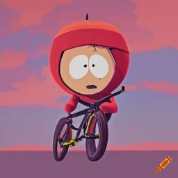

# bmXr

Goal: create a first-person BMX game using ThreeJS and WebXR

## Game Mechanics

Goal: create mechanics that require skill and have a clear parrallel to real-life actions required to perform the tricks

An inspiration is Skate 3, which requires joystick movements similar to how you would need to manipulate a board in real-life

### Barspin

Goal: rotate controllers and time the button presses to "throw" and "catch" a barspin

e.g.

- hold the inside buttons when holding the handlebars
- release one
- rotate the hand still pressing the button to initiate the bar spinning
- release the second trigger
- wait for the bars to spin
- time the "catch", press the inside button on the controller to catch the first grip
- "catch" the second grip

## Aesthetics

Would love to go for a south park inspired aesthetic eventually

